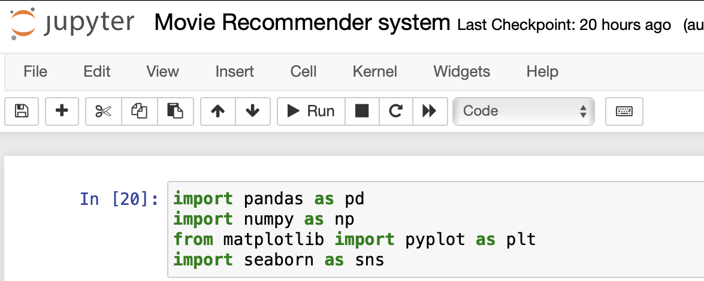
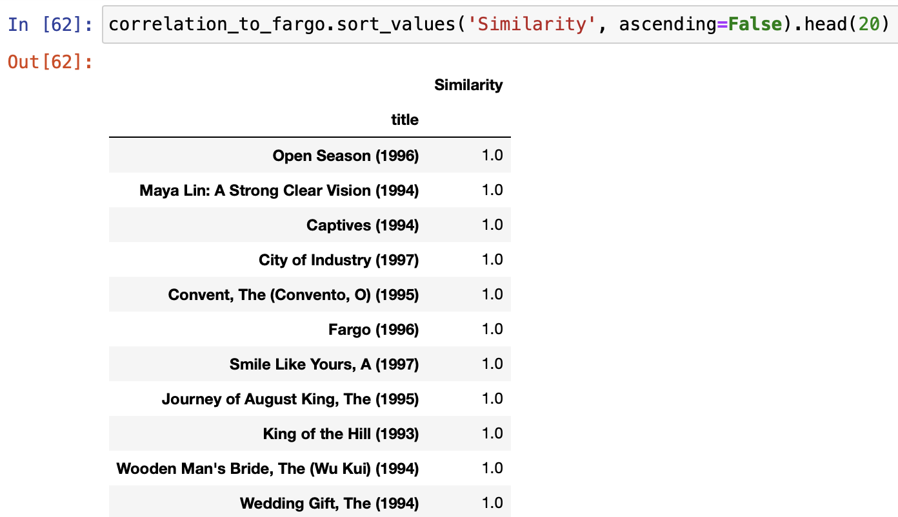
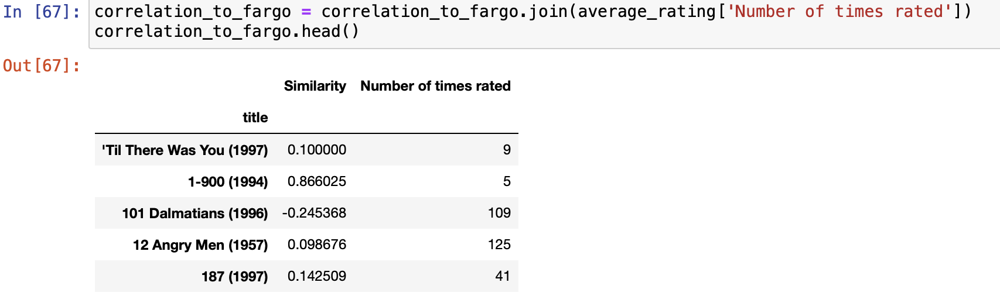
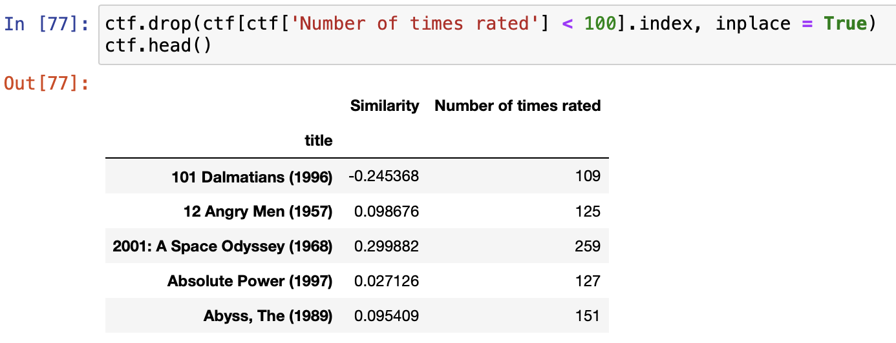
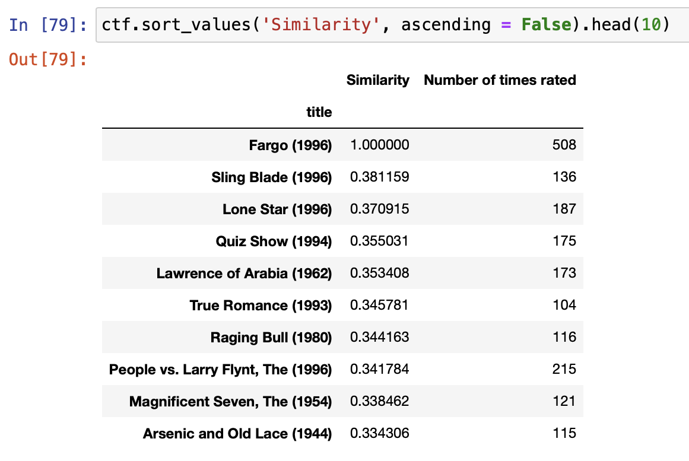

# Recommender-System #
A recommender system that suggests movies according to ratings from various users.

## Abstract
Recommender systems are machine learning-based systems that scan through all possible options and provides a prediction or recommendation. However, building a recommendation system has the below complications: Users' data is interchangeable.

## System Requirements
Memory and disk space required per user: 1GB RAM + 1GB of disk + .5 CPU core.
Server overhead: 2-4GB or 10% system overhead (whatever is larger), .5 CPU cores, 10GB disk space.
Port requirements: Port 8000 plus 5 unique, random ports per notebook.

## Installation
You can find the installation documentation for the
[Jupyter platform, on ReadTheDocs](https://jupyter.readthedocs.io/en/latest/install.html).
The documentation for advanced usage of Jupyter notebook can be found
[here](https://jupyter-notebook.readthedocs.io/en/latest/).

For a local installation, make sure you have
[pip installed](https://pip.readthedocs.io/en/stable/installing/) and run:

    $ pip install notebook 
    
 In the event that you do not have python installed, it could be installed locally by running :
 
    $ pip install python
   
 Other system requirements to execute this project are : Numpy , Pandas, Matplotlib and seaborn.
 All of which can be installed locally using pip . i.e :
    
    $ pip install numpy
    $ pip install pandas
    $ pip install matplotlib
    $ pip install seaborn

## Usage - Running Jupyter notebook

### Running in a local installation

Launch with:

    $ jupyter notebook

### Running in a remote installation

You need some configuration before starting Jupyter notebook remotely. See [Running a notebook server](https://jupyter-notebook.readthedocs.io/en/stable/public_server.html).

##  Project Description
To create a Recommender system based on any dataset available at : https://github.com/caserec/Datasets-for-Recommneder-Systems.

### Execution of project
Dataset used can be found here : https://grouplens.org/datasets/movielens/

MovieLens or ML data sets were collected by the GroupLens Research Project at the University of Minnesota.
This dataset (ml-latest-small) describes 5-star rating and free-text tagging activity from MovieLens, a movie recommendation service. It contains 100836 ratings and 3683 tag applications across 9742 movies. These data were created by 610 users between March 29, 1996 and September 24, 2018.
Users were selected at random for inclusion. All selected users had rated at least 20 movies. No demographic information is included. Each user is represented by an id, and no other information is provided.

## Content and Use of Files

### Ratings Data File Structure (ratings.csv)

All ratings are contained in the file `ratings.csv`. Each line of this file after the header row represents one rating of one movie by one user, and has the following format:

    userId,movieId,rating,timestamp

The lines within this file are ordered first by userId, then, within user, by movieId.

Ratings are made on a 5-star scale, with half-star increments (0.5 stars - 5.0 stars).

Timestamps represent seconds since midnight Coordinated Universal Time (UTC) of January 1, 1970.

### Movie Data File Structute (movie.csv)

Movie information is contained in the file `movies.csv`. Each line of this file after the header row represents one movie, and has the following format:

    movieId,title,genres

Movie titles are entered manually or imported from <https://www.themoviedb.org/>, and include the year of release in parentheses. Errors and inconsistencies may exist in these titles.

Genres are a pipe-separated list, and are selected from the following:

- Action
- Adventure
- Animation
- Children's
- Comedy
- Crime
- Documentary
- Drama
- Fantasy
- Film-Noir
- Horror
- Musical
- Mystery
- Romance
- Sci-Fi
- Thriller
- War
- Western

movieId is an identifier for movies used by <https://movielens.org>. E.g., the movie Toy Story has the link <https://movielens.org/movies/1>.

## Execution : 
__Step by step description:__

- Locally launching Jupyter notebook 
- Importing the necessary libraries.

- Loading the dataset
- Merging the datasets on a common key i.e : 'movieId'
- Data readings on the count and mean of 'ratings'
- Creation of a data frame that summarizes the data
- Exploratory data analysis with the new dataframe
- Creation of a pivot table to provide a multi-dimensional summary of the data : using 'userId' as an axis and 'movie title' as the another axis
- Sorting data for better understanding
- Creation of panda series according to pivot table
- Finding the correlation/similarities between 2 panda series by using : corrwith(pandas series)
- Converting panda series back to data frame and dropping NaN values
- Sorting data in descending order to find movies with a higher correlation value

### Mode of Filtering
Content-based filtering : uses item features to recommend other items similar to what the user likes, based on their previous actions or explicit feedback. In this case, the feature used is the movie ratings.

## Test
We see the movies recommended to us based on their similarities in relation to the movie 'Fargo'

Note : The list is in the descending order, meaning it displays the most similar movies first.

__Adding the 'Number of times rated' column gives a clearer description of the data and how/why certain movies are recommended.__

## Short-comings :

Many people have not watched many movies so there is some bias in the data. Some movies have been rated only once and this leads to an irregularity in the data.
This can be fixed by putting a paremeter on the column 'Number of times rated'. i.e : setting a parameter that forces the system to display movies that have been rated over a hundred times.
    
__ctf : correlation_to_fargo.__

   In order to increase the efficacy of the recommender , we instill a paremeter that drops/deletes movies that have been rated less than 100 times.

   Then we sort in descending order to get the most similar movies.
   

